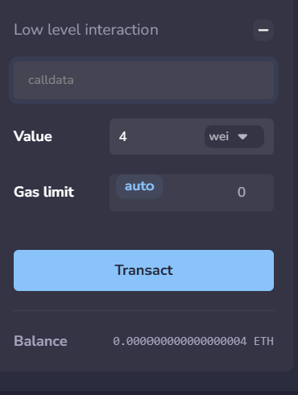

## there is nothing to code just the concept lets understand call data level by level

What is this call data here 

## level 1 understanding 
So let's just understand what a calldata is from a normal function prespective then we will get into the fallback one....so when we call a function such as setNum or any thing like the data we pass as the parameter inside the function(some data that user sends) is calldata ?

That's a nice way to understand it and we are pretty close tbh...
yes the agrument is the calldata but it is not the complete calldata the function which we call along the args is also the call a calldata 

so combinely calldata = function + it's args 

this calldata is send to the blockchain aka to the contract to tell "Ahh this function to execute with this params/args...." so you can understand it as info what we send to the contract is calldata.

## Now on to the main question 
In remix ide on low level interaction the tab through which we could make send the eth has a calldata tab which is mostly empty while sending the eth/wei what is it then ?

This is exactly what you understand......you send the eth and tell weather you want to erxecute a function along with the transaction or not ? 

if yes then the calldata = function call , 
and the value = amount

if not then calldata = empty 
value = the amount (and is receive ir fallback execute it)

## Also if you are thinking you can so something like this 

contract Test {
    function getBalance() public view returns(uint) {
        return address(this).balance;
    }

    uint public num;

    function setNum(uint _num) public returns(uint) {
        return num = _num;
    }

    fallback() external payable { }
    receive() external payable { }

}

And then call setNum(42) in calldata tab of low level interaction then it won't work cause it accepts only ABI incoded function format...

Well then how do we use it then ??

It will be difficult to explain in these simple function but yeah it is used in working and real contracts....will encounter that some day too..